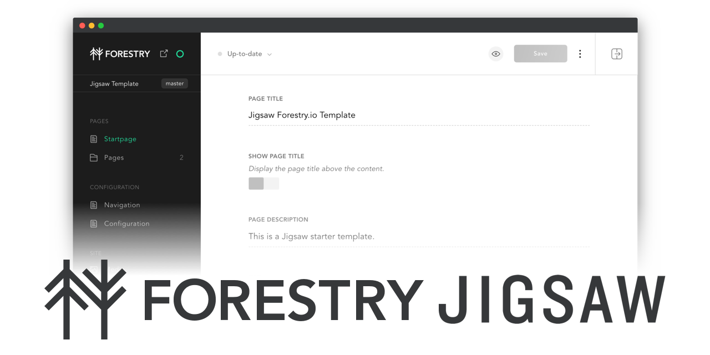

# 
Simple Jigsaw website template for Forestry.io, with easy deployment Netlify ⚡️
- [Jigsaw – Static Sites for Laravel Developers](https://jigsaw.tighten.co/)
- [Forestry.io - Git-backed CMS](https://forestry.io/)
- [Netlify - All-in-one platform for automating modern web projects](https://www.netlify.com/)

## Features

This Jigsaw starter template comes pre-configured with:
- Simple responsive website layout ([preview](https://jigsaw-forestry-template.netlify.com))
- Bootstrap 4.1.3
- Vue 2.5.21
- Sitemap Generator
- Netlify deployment configuration

In addition it includes a Forestry.io configuration with the following features:
- Easily add new pages
- Arrange items in the navigation bar
- Basic css styling directly in the CMS 
- [Cloudinary](https://cloudinary.com/) media management
- Live preview 🖥✨(powered by CircleCI docker image `circleci/php:7.3-node`)  

## Requirements
- PHP 7.1 or higher
- [Composer](https://getcomposer.org/)
- Node / npm
- [Yarn](https://yarnpkg.com/)

## Installation
### Jigsaw / Template
To use this starter template, create a new directory for your website:
```bash
mkdir cool-website
```

After that, navigate to your website folder and install Jigsaw:
```bash
cd cool-website
composer require tightenco/jigsaw
```

Now you can initialize the project with the template:
```bash
./vendor/bin/jigsaw init helloiamlukas/jigsaw-forestry-template
```

💡For further information, please take a look at the [Jigsaw Documentation](https://jigsaw.tighten.co/docs/installation/)

### Cloudinary Configuration

In order to make media uploads work properly, open the `.forestry/settings.yml` file and put in your cloudinary upload directory, as well as your cloud name.

For example: 

```yaml
upload_dir: cool-website-media
public_path: https://res.cloudinary.com/coolcloud/image/upload/w_1600,q_auto,c_limit
```

### Deployment
For easy deployment, use [Netlify](https://www.netlify.com/). The template already includes a `netlify.toml` file with all necessary configuration. Just import your repository from the [Dashboard](https://app.netlify.com/) and you're good to go!

### Forestry.io Setup

After you have deployed your website, you can setup [Forestry.io](https://forestry.io/).

Login into your Forestry.io account and go to the [Dashboard](https://app.forestry.io/dashboard/).

1. Add a new site
2. You will be asked, which static site generator you want to use. Choose *Other (Gridsome, Next, Nuxt…)*
3. Next, choose your Git provider and select your repository.
4. After the project has been imported, **ignore the setup wizard**.
5. In the sidebar, go to *Settings* and select *General » Deploy Admin* to generate the CMS Backend.
6. Now, you should be apple to access the CMS via [https://your-site-name.netlify.com/manage/](https://your-site-name.netlify.com/manage/)
